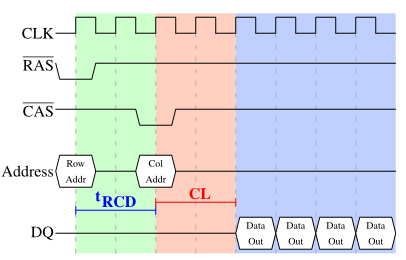

# 第2章：商用硬件现状

译者注：这里指的是2007年的”现状“，今天我们再来看这个章节的时候需要用历史的眼光来看待它

## 2. 商用硬件现状

由于专用的硬件正在逐渐淡出，理解商用硬件的现状变得很重要。时至今日，水平扩展比垂直扩展更为常见，也就是说，人们使用大量小型的、互联的商用计算机代替大型的、超快（也超贵）的系统，这更加符合成本效益，这是因为快速且廉价的网络硬件随处可见，虽然那些大型的专用系统仍然有一席之地，依然有其商机，但是整体上已经被商用硬件市场蚕食。Red Hat在2007年的时候预计，未来的产品，构成数据中心的 “标准构件块” （standard building blocks）将会是一台拥有最多4个插槽的计算机，每个插槽上面插着一个四核CPU，这些CPU，如果拿 Intel 来举例的话，都是超线程的 _{ 脚注2：超线程使单个处理器核能并行处理两个以上的任务，只需加入一点点额外的硬件 }_。也就是说，这些数据中心的标准系统将拥有最多64 个虚拟处理器，当然未来能够支持更大的系统，但是当前人们认为4插槽、4核CPU是最佳配置，绝大多数的优化都针对这样的配置。

使用商用硬件构建出的计算机，在结构上也存在巨大的差异，不过，我们将专注于最主要的差异上，从而基本上可以涵盖到超过90%以上的硬件。值得注意的是，这些技术上的细节往往日新月异，变化极快，因此大家在阅读的时候也需要注意本文的撰写时间。

这些年来，个人计算机和小型服务器都已经被标准化到了一个芯片组上，该芯片组由两个部分组成：北桥和南桥，图2.1示意了这种结构。

> 
>
> 图2.1 包含北桥和南桥的结构

所有的CPU（在上面的例子中有两个，但可以有更多）通过一条通用总线（前端总线，简称FSB）连接到北桥。北桥主要包括内存控制器和其它一些组件，内存控制器的具体实现决定了RAM芯片的类型，不同类型的RAM，诸如DRAM、Rambus和SDRAM等等，需要不同的内存控制器。

为了连通其它系统设备，北桥需要与南桥通信。南桥经常被称作I/O桥，通过多条不同的总线与设备通信。目前，比较流行的总线有PCI、PCI Express、SATA和USB总线，除此以外，南桥还支持PATA、IEEE 1394、串口和并口等。比较老旧的系统上还有附属于北桥的AGP槽，那是由于南北桥间缺乏高速连接而采取的措施，现在的PCI-E槽都是直接连到南桥的。

这种系统结构有一些需要注意的地方：

* 从一个CPU到另一个CPU的所有数据必须经过与北桥通信的同一条总线
* 所有与RAM的通信需要经过北桥
* RAM只有一个端口 _{ 脚注3：本文不会介绍多端口RAM，因为商用硬件不采用这种内存，至少程序员无法访问，这种内存一般用在专用硬件中，比如对速度有着极高要求的路由器等 }_
* 一个CPU与依附于南桥的设备之间的通信需要经过北桥

在上面这种设计中，瓶颈马上出现了。

第一个瓶颈与设备对RAM的访问有关。在早期的PC中，不管是在南桥还是北桥上，所有设备之间的通信都需要经过CPU，这对整个系统的性能产生了负面的影响。为了绕开这个问题，有些设备加入了直接内存访问（DMA）的能力。DMA允许设备在北桥的帮助下，在无需CPU介入（以及相应的性能成本）的情况下，直接读写RAM。到了今天，所有依附于总线上的高性能设备都可以使用DMA。虽然DMA大大降低了CPU的负担，也会引起北桥带宽的争用，也就是DMA请求与来自CPU的RAM访问请求之间会产生竞争，因此这个问题也必须被纳入考虑的范畴。

第二个瓶颈涉及北桥与RAM之间的总线。总线的具体情况与内存的类型有关。在早期的系统上，只有一条总线，因此不能实现并行访问。近年来的RAM需要两条独立总线（或者说是通道，DDR2这么称呼它们），可以实现带宽的加倍。北桥将内存访问请求交错地分配到两个通道上，更新的内存技术（如FB-DRAM）甚至加入了更多的通道。

由于可用的带宽有限，我们需要以一种使延迟最小化的方式来对内存访问进行调度。如同我们将会看到的那样，处理器的速度比内存要快得多，需要等待内存的访问，尽管使用了CPU缓存（_会有缓存不命中的情况存在_）。如果有多个超线程，多个CPU核，或者多个CPU处理器同时访问内存，那么等待时间还会更长，对于DMA操作也是同样如此 。

除了并发以外，内存访问还有其他的问题 ，比如访问模式也会极大地影响内存子系统、特别是多通道内存子系统的性能。在2.2节中我们会覆盖RAM访问模式更多的细节。

在一些比较昂贵的系统上，北桥自身并不含内存控制器，而是将北桥连接到外部的多个内存控制器上（在下例中，共有4个内存控制器）。

> 
>
> 图2.2 包含外部控制器的北桥

这种架构的好处在于，多条内存总线的存在，使得总带宽也随之增加了。而且可以支持更多的内存。并发内存访问模式通过同时访问不同内存bank（_译注：bank这个词好像没有合适的中文翻译，保留英文_），可以降低延时，这对于像图2.2这种多个处理器直接连接到北桥的设计来说，尤其有效。对于这样的设计，主要的限制是北桥的内部带宽，对于这种体系结构来说（北桥的内部带宽）是相当惊人的 _{ 脚注4：出于完整性的考虑，还需要补充一下，这样的内存控制器布局还可以用于其它用途，比如说「内存RAID」，它可以与热插拔技术一起使用 }_。

使用外部内存控制器并不是提升内存带宽的唯一办法，另一个最近比较流行的方法是将内存控制器集成到CPU内部，将内存直连到每个CPU。这种架构的走红归功于基于AMD Opteron处理器（_指皓龙处理器_）的SMP（_对称多处理器_）系统。图2.3展示了这种架构。Intel 则会从基于Nehalem架构的处理器开始支持通用系统接口（简称 CSI），基本上也是类似的思路：一个集成的内存控制器，为每个处理器提供本地内存。

> 
>
> 图2.3 集成的内存控制器

通过采用这样的架构，系统里有几个处理器，就可以有几个内存bank。比如，在一台四核CPU的计算机上，不需要一个拥有巨大带宽的复杂北桥，就可以实现四倍的内存带宽。另外，将内存控制器集成到CPU内部还有其它一些优点，这里就不赘述了。

同样它也有缺点。首先，系统仍然要让所有内存能被所有处理器所访问，导致内存不再是一致的资源（于是这种系统便有了 NUMA，即非一致性内存架构这个名字）。处理器访问本地内存（附属于该处理器的内存）能以正常的速度访问，但是访问附属于其它处理器的内存时，需要使用处理器之间的互联通道。比如说，CPU1要访问附属于CPU2的内存，则需要使用它们之间的互联通道。如果它需要访问附属于CPU4的内存，那么需要跨越两条互联通道。

使用互联通道是有代价的。在讨论访问远端内存的代价时，我们会使用 “NUMA因子” 这个词。在图2.3的示例中，每个CPU有两个层级：紧邻的CPU，以及两个互联通道之外的CPU。在更加复杂的系统中，层级会随之显著增长，有些机器还有不止一种连接（比如 IBM 的 x445 和 SGI 的 Altix系列），它们的CPU被组织成为节点，访问同一节点内的内存是一致的，或者只需很小的NUMA因子，然而节点之间的连接非常昂贵，而且有很高的NUMA因子。

目前，已经有商用的NUMA计算机，而且它们在未来应该会扮演更加重要的角色。人们预计，从2008年底开始，每台SMP机器都会使用NUMA。当一个程序在一台NUMA机器上运行的时候，意识到NUMA带来的成本是很重要的。在第5章中，我们将讨论更多的机器架构，以及Linux内核为这些程序提供的一些技术。

除了本章的其余部分所述的技术之外，还有其它一些因素会影响RAM的性能，但是它们无法被软件所左右，所以没有放在这里，有兴趣的读者可以从第2.1节中了解到其中的一些，这里介绍这些技术，仅仅是因为它们能让我们对RAM技术有比较完整的理解，或者在大家购买计算机时能够提供一些帮助。

以下的两小节主要介绍一些 “门级” 的硬件知识，同时还会讨论内存控制器与DRAM芯片间的访问协议，程序员或许会得到一些启发，因为这些知识解释了为什么内存访问是这样工作的，不过，这部分内容并不是必读的，心急的读者可以直接跳到第2.2.5节。

### 2.1 RAM的类型

这些年来，出现了许多不同类型的RAM，各有差异，有些甚至有非常大的不同，当然了只有历史学家可能会对那些很古老的RAM类型感兴趣，我们在这里就不仔细研究了。我们将会聚焦于几种现代类型的RAM，不过仅是触及它们的表面而已，探索一下内核或者是应用开发人员可以通过性能特征看到的一些细节。

第一个有趣的细节是，为什么在同一台机器中会有不同类型的RAM？具体的说，为什么我们既有静态RAM（SRAM _**{** 脚注5：在不同的上下文中，SRAM还可以表示「同步内存」}_），又有动态RAM（DRAM），两者的功能相同，但是前者更快。既然如此，那为什么不全部使用SRAM呢？答案，正如你可能预料的，是成本。无论是在生产或者是在使用上，SRAM都比DRAM要贵得多，这两个成本因素都很重要，而且后者变得越来越重要。为了理解这一点，我们分别看一下SRAM和DRAM的一个比特的存储的实现过程。

在本小节的其余部分，我们将讨论RAM实现的底层细节，我们将尽可能为你展现一些底层细节，为此，我们会在 “逻辑层面” 讨论信号，但不是硬件设计师那种层面，因为那种层级对我们这里的讨论目的来说是没有必要的。

#### **2.1.1 静态RAM**

> 
>
> 图2.4 6-T 静态RAM

图2.4展示了一个由6个晶体管组成的SRAM单元。核心是4个晶体管$$\mathbf{M_{1}}$$ 到 $$\mathbf{M_{4}}$$，它们组成两个交叉耦合的反相器。它们有两个稳定的状态，分别代表0和1。只要保持$$\mathbf{V_{dd}}$$一直通电，状态就是稳定的。

若要读取RAM的状态，就拉高字线$$\mathbf{WL}$$的电平，这使得RAM的状态在 $$\mathbf{BL}$$ 和 $$\overline{\mathbf{BL}}$$ 上变得立即可读，若要修改RAM的状态，那么需要先将 $$\mathbf{BL}$$ 和 $$\overline{\mathbf{BL}}$$ 设置为想要的值，然后再拉升$$\mathbf{WL}$$ 的电平，由于外部的驱动强于内部的四个晶体管$$\mathbf{M_{1}}$$ 到 $$\mathbf{M_{4}}$$，这使得旧的状态被改写。

更多详情，请阅读【参考文献20】，为了方便下面的讨论，需要注意以下几个问题：

* 一个SRAM单元需要6个晶体管，也有采用4个晶体管的SRAM，但有缺陷
* 维持稳定的状态需要恒定的电源
* 拉升WL的电平之后几乎立即可以读取状态，信号是矩形的（快速在两种状态之间切换）
* 状态稳定，不需要循环刷新

SRAM也有其它形式，不那么费电，但比较慢。由于我们需要的是快速RAM，因此这不在我们的关注范围内。这些较慢的SRAM的主要优点在于接口简单，比动态RAM更容易使用。

#### **2.1.2 动态RAM**

动态RAM在结构上比静态RAM要简单得多，图2.5展示了一种常见的DRAM的结构，它仅由一个晶体管和一个电容器组成。显然，这种复杂性上的巨大差异意味着功能上的迥异。

> 
>
> 图2.5 1-T 动态RAM

一个动态RAM的状态保持在电容器$$\mathbf{C}$$ 中。晶体管 $$\mathbf{M}$$用来控制访问。如果要读取状态，需要拉高访问线 $$\mathbf{AL}$$的电平，这时，可能会有电流经过数据线 $$\mathbf{DL}$$，也可能没有，这取决于电容器中的电量。如果要写入状态，那么先要恰当地设置 $$\mathbf{DL}$$，然后拉高$$\mathbf{AL}$$一段足够的时间，直到电容器充电或放电完成。

动态RAM有很多设计方面的难点。使用电容器意味着读取状态时需要对电容器放电，这件事情不能无限重复，必须在某个时间点上对电容重新充电。

更糟糕的是，为了容纳大量的内存单元（现在一般在单个芯片上普遍能容纳10的9次方以上的RAM单元），电容器的容量必须很小（飞法拉，或者以下）。这样，完全充电之后大约持有几万个电子。即使电容的电阻很大（几兆欧），仍然只需很短的时间就会耗光电荷，这个问题被称为 “漏电”。

这种泄露就是DRAM芯片必须持续刷新的原因，对于现今大部分的DRAM芯片，每隔64ms就必须进行一次刷新，在刷新期间是无法访问该内存芯片的，因为重新充电基本上就是直接丢弃结果的读取操作，对于某些情况下的工作负载来说，这个额外的开销可能会占到内存访问的50%（参考文献【3】）。

第二个因微小电量而造成的问题是，直接读取到的内存单元中的信息无法直接使用，必须通过感知放大器，它能够根据逻辑1的阈值电量来分辨0和1。

第三个问题是，从内存单元进行读取会消耗电容的电量，这代表每次读取操作都必须伴随着重新对电容充电的动作，虽然这能够通过将感知放大器的输出反馈给电容来自动达成，但是它代表读取内存单元需要额外的能量，更重要的是，时间。

第四个问题是，电容的充放电不是立即完成的，这就导致了感知放大器读取到的信号并不是理想的矩形信号，因此需要一个保守的估算，从而得知何时可以使用内存单元的输出结果，电容充放电的公式如下

> ![\[Formulas\]](http://static.oschina.net/uploads/img/201302/06104432_i34C.png)

这就意味着需要一些时间（时间长短取决于电容C和电阻R）来对电容进行充放电，也代表着无法立即使用能被感知放大器侦测的电流。图2.6显示了充放电的曲线，X 轴以 RC（电阻乘以电量）为单位，这是一种时间单位。

与静态RAM可以在字线拉高时立即读取数据不同，当要读取动态RAM的时候，需要花费一点时间来等待电容的充分放电，这个延迟严重限制了DRAM能够达到的速度。

当然了，这种简单的读取方式也是有优点的，最主要的优点是大小。比起一个SRAM，一个DRAM的尺寸要小好几倍。SRAM需要独立的供电来维持晶体管的状态，DRAM的结构较为简单，这也就意味着DRAM能够较为容易地将很多内存单元塞入一个芯片中。

综上所述，DRAM赢在（巨大的）成本差异，除了一些特殊的硬件（比如路由器）之外，我们的硬件大多是使用DRAM来作为主存的，这一点对于程序员有着深远的影响，后文将会对此进行讨论。在此之前，我们还是先了解一下使用DRAM的更多细节。

#### **2.1.3 DRAM 访问**

程序在给出内存地址的时候使用的是虚拟地址，处理器把虚拟地址转换为物理地址，最后内存控制器根据地址来选择匹配的RAM芯片，为了在RAM芯片中选择单个的内存单元，部分的物理地址会以多条地址线的形式被传递。

由内存控制器直接对单个内存位置进行寻址有点不切实际：4G的RAM将需要2的32次方条地址线，作为替代，地址会被编码成二进制数字，使用一组较小的地址线来进行传递，以这种方式传递到DRAM芯片的地址，首先需要解复用（demultiplexer），N条地址线的解复用器将会有2的N次方条地址输出线，这些地址输出线被用来选择相应的内存单元，使用这种直接的方法对于小容量芯片不是个大问题。

但随着内存单元的数量增加，这种方法就不再适合了。一个1G容量的芯片_{ 脚注6：我反感那些SI前缀，对我而言，一个giga-bit将总是2的30次方， 而不是10的9次方 }_ 将需要30条地址线和2的30次方条地址选择线（select line）。在不牺牲速度的前提下，一个解复用器的大小会随着输入线的数量呈指数式递增。用于30条地址线的解复用器需要一大堆芯片的空间，外加解复用器的（尺寸与时间）复杂度。更重要的是，同步传输30个脉冲要比仅仅传输15个脉冲困难的多，因为（15个脉冲的情况下）可以在相同的长度上对较少的地址线进行布局以及对时序进行调整 _{_ _脚注7：现代DRAM，像DDR3能自动调整时序，但还是会有容忍度上的限制 }_

图2.7 展示了一个从很高的维度来看的DRAM芯片，DRAM被组织为行和列。虽然你可以把他们全部都排成一行，但那样的话DRAM芯片就需要一个庞大的解多路复用器。通过矩阵的方式能够以一半大小的解多路复用器与多路复用器达到这个目的 _{ 脚注8：复用器和解复用器是等价的，这里的复用器在写的时候需要作为解复用器工作，所以从现在开始我们就不再区分了 }_  这从各个方面来说都会是一个很大的节约。

在这个例子中，地址线a0和a1通过行地址选择$$\overline{\mathbf{RAS}}$$ 解多路复用器 _{ 脚注9：信号上面的横线代表反向信号 }_ 来选取整个行，当读的时候，所有的这些内存单元对于列地址选择$$\overline{\mathbf{CAS}}$$ 多路选择器来说都可用，依据地址线a2和a3一个列的内容便能够提供给DRAM的数据引脚。这会在许多的DRAM芯片上并行发生多次，从而产生相应数据总线的所有比特信息。

对于写操作，内存单元的数据新值放到数据总线，当使用$$\overline{\mathbf{RAS}}$$和$$\overline{\mathbf{CAS}}$$选中内存单元时，数据被存到该内存单元内。这是一个相当直观的设计，但是在现实中 —— 很显然 —— 会复杂得多，对于读，需要规范定义从发出信号到数据在数据总线上变得可读的时延，电容不会像前面章节里面描述的那样立刻自动放电，从内存单元发出的信号是如此微弱以至于它还需要被放大。对于写，必须规范定义从数据$$\overline{\mathbf{RAS}}$$和$$\overline{\mathbf{CAS}}$$操作完成之后到数据成功被写入内存单元的时延（同样地，电容不会立刻充电和放电）。这些时间常数对于DRAM芯片的性能是至关重要的，我们将在下个小节来讨论它们。

一个相对次要的，关于伸缩性的问题是，用30条地址线连接到每一个RAM芯片是行不通的。芯片的引脚是非常珍贵的资源，数据必须尽可能并行传输（例如，以64位批量传输），这已经够 “糟” 的了，内存控制器还必须有能力寻址每一个RAM模块（RAM芯片的集合），如果因为性能的原因要求并发行访问多个RAM模块并且每个RAM模块需要自己独占的30条或者更多的地址线，那么对于8个RAM芯片的模块，仅仅是用来解析地址，内存控制器就需要多达240+的针脚。

在很长一段时间里，DRAM芯片利用地址线复用技术来解决这个可扩展性问题。这意味着地址被转换成两部分。第一部分由行选择地址位组成（如图2.7中的a0和a1），这个选择一直保持有效直到撤销，然后是第二部分，地址位a2和a3用来选择列。关键差别在于：只需要两根外部的地址线，加上额外很少的线来指明何时$$\overline{\mathbf{RAS}}$$和$$\overline{\mathbf{CAS}}$$信号有效，但这相对于减半地址线来说，只是很小的代价，但是地址复用技术也会给自身带来一些问题，我们将在2.2小节中讨论。

#### **2.1.4 总结**

如果这个小节的内容压得你有些喘不过气，不用担心，从本节中摘取的重点内容是：

* 不是所有的存储器都是SRAM的原因
* 存储单元需要单独选择来使用
* 地址线数目直接决定了内存控制器，主板，DRAM模块和DRAM芯片的成本
* 在读取或写入操作的结果有效之前得等上一段时间

接下来的章节会涉及更多的有关访问DRAM存储器的实际操作的细节。我们不会提到更多有关访问SRAM的具体内容，它通常是直接寻址，之所以这样做是为了速度以及SRAM存储器的大小有限。SRAM现在应用在CPU的高速缓存且内建于芯片之中，它们的连线短且完全在CPU设计师的掌控之下。我们以后会讨论CPU高速缓存这个主题，我们需要知道的是SRAM存储单元是有一个确定的最高速度的，这取决于设计师花费在SRAM上的力气，缓存的速度范围从略慢于CPU核心到慢一到两个数量级之间。  

### 2.2 DRAM的访问细节

在前面介绍DRAM的章节中，我们看到为了节省DRAM芯片的引脚数量，进行了地址复用。我们也看到因为DRAM内存单元中的电容无法立即放电以产生稳定的信号，读写内存单元会花点时间；此外，我们也看到了DRAM内存单元必须不停地刷新，现在，是时候将这些因素拼到一起看看它们如何决定DRAM的访问过程。

我们将会聚焦于当前的技术上；我们不会讨论异步DRAM及其变种，如果对这个话题感兴趣的读者请参考【参考文献3】和【参考文献19】。我们也不会谈及Rambus DRAM（RDRAM），虽然这项技术并不过时，但它在系统内存领域应用并不广泛，我们将主要介绍同步 DRAM（SDRAM）与其后继者，即双倍速 DRAM（DDR）。

同步DRAM，顾名思义，是参照一个时钟源来工作的。内存控制器提供一个时钟，时钟的频率决定了前端总线（FSB）的速度 – 内存控制器提供给DRAM芯片的接口。在我撰写本文时，时钟频率已经达到 800MHz、1,066MHz、甚至 1,333MHz，并且宣称下一代会达到更高的频率1,600MHz。但是这并不代表总线上的频率真的有这么高，实际上目前的总线都是双倍或者四倍传输的，每个周期传输两次或者四次数据。由于报出来的数字越高就会卖得越好，因此厂商喜欢把四倍传输的200MHz总线宣传为 “有效的“ 800MHz总线。

以今天的SDRAM为例，每次数据传输包含64位，即8字节。所以FSB的传输速率应该是有效总线频率乘以8字节（对于4倍传输200MHz总线而言，传输速率为6.4GB/s）。听起来很高，但要知道这只是峰值速率，是实际上无法超越的最高速率。我们稍后会看到，与RAM模块通信的协议有大量时间处于非工作状态，不进行数据传输，我们必须对这些非工作时间有所了解，并尽量缩短它们以获得最佳的性能。

#### **2.2.1 读访问协议**

图2.8 展示了某个DRAM模块上的一些引脚上的时序，可分为三个阶段，图中以不同的颜色表示。按照惯例，时间为从左向右流逝，这里忽略了许多细节，我们只关注时钟频率、$$\overline{\text{RAS}}$$与$$\overline{\text{CAS}}$$信号、地址总线和数据总线。首先，内存控制器将行地址放在地址总线上，并拉低$$\overline{\text{RAS}}$$信号，读周期开始。所有信号都会在时钟（CLK）的上升沿被读取，因此，只要信号在读取的时间点上保持稳定，就算不是标准的方波也没有关系。设置行地址会使得RAM芯片锁住指定的行。

经过 tRCD（$$\overline{\text{RAS}}$$ 至 $$\overline{\text{CAS}}$$ 的延迟）个时钟周期，发出 $$\overline{\text{CAS}}$$ 信号。内存控制器将列地址放在地址总线上、拉低 $$\overline{\text{CAS}}$$ 的电平来传输。这里我们可以看到，地址的两个部分是如何通过同一条总线来传输的。

至此，寻址结束，可以传输数据了。但RAM芯片仍然还需要一些准备时间，这个时间称为CAS时延\(CL\)。在图2.8中CL为2，这个值可大可小，它取决于内存控制器、主板和DRAM模块的质量，CL还可能是半周期的，假设CL为2.5，那么数据将在蓝色区域内的第一个时钟下降沿准备就绪。

既然传输数据需要做这么多的准备工作，仅用来传输一个字就显得太浪费了。因此，DRAM模块允许内存控制器指定传输多少数据。通常是2、4或8个字。这样，就可以一次填满高速缓存的整条线，而不需要额外的$$\overline{\text{RAS}}$$与$$\overline{\text{CAS}}$$信号序列。另外，内存控制器还可以在不重置行选择信号的前提下发送新的$$\overline{\text{CAS}}$$信号。这样，读取或写入连续的地址就可以变得非常快，因为不需要发送$$\overline{\text{RAS}}$$信号，也不需要把行置为非激活状态（见下文）。内存控制器决定是否要将行保持为 “打开” 状态，让它一直保持 “打开” 状态对实际的应用程序来说会有一些负面的影响（参考文献【3】）。发送新的$$\overline{\text{CAS}}$$信号与RAM模块的命令速率有关（通常标记为Tx，其中x为1或2，高性能的DRAM模块一般为1，表示每个周期都可以接收新的命令\)。

在上图中，SDRAM的每个周期输出一个字的数据。这是第一代的SDRAM，而DDR可以在一个周期中输出两个字，这种做法可以减少传输时间，但无法降低时延。DDR2尽管看上去不同，但本质上也是相同的做法，就不再深入介绍了，只需要知道DDR2更快、更便宜、更可靠、更节能就足够了，请参见【参考文献6】。

#### **2.2.2 预充电与激活**

图2.8 并不完整，它只画出了访问DRAM的完整周期的一部分。在发送新的$$\overline{\text{RAS}}$$信号之前，必须先把当前锁住的行置为非激活状态，并对新的行进行预充电。在这里，我们主要讨论通过发送指令来显式触发以上行为的情况，协议本身作了一些改进，在某些情况下是可以省略这个步骤的，但是预充电带来的时延还是会影响整个操作。

图2.9显示的是从一个$$\overline{\text{CAS}}$$信号开始，到另一个$$\overline{\text{CAS}}$$信号为止的时序图，第一个$$\overline{\text{CAS}}$$信号要求的数据在CL周期之后准备就绪。图中的例子里，一个SDRAM用两个周期传输了两个字的数据，如果换成DDR的话可以传输4个字。

即使是在一个命令速率为1的DRAM模块上，也无法立即发出预充电命令，而要等数据传输完成。在上图中，即为两个周期，刚好与CL相同，但这只是巧合而已。预充电信号并没有专用的线，某些实现是用同时拉低写使能$$\overline{\text{WE}}$$ 和$$\overline{\text{RAS}}$$ 的电平来发出这个命令，实际上这个组合本身没有什么特别的意义，编码细节参见【参考文献18】。

发出预充电信命令后，还需等待tRP（行预充电时间）个周期之后才能使行被选中。在图2.9中，这个时间（紫色部分）大部分与内存传输的时间（淡蓝色部分）重合，这很好！但tRP比传输时间还长，因此下一个$$\overline{\text{RAS}}$$信号只能等待一个周期。

如果我们延伸上图中的时间线，会发现下一次数据传输发生在前一次的5个周期之后，这意味着，数据总线的7个周期中只有2个周期才是真正在用的，用它乘于FSB速度，结果就是，800MHz总线的理论速率6.4GB/s降到了1.8GB/s，真是太糟了，而且必须避免，在第6章将会介绍一些技术，可以帮助我们提升这个数值，但是程序员通常也要尽自己的一份力。

对于SDRAM模块，还有一个我们没有谈到的定时值，在图2.9中，预充电命令仅受制于数据传输时间。除此之外，SDRAM模块在$$\overline{\text{RAS}}$$信号之后，需要经过一段时间，才能为另一行进行预充电（记为tRAS）。这个数值通常很大，一般是tRP的2到3倍。如果在某个$$\overline{\text{RAS}}$$信号之后，只有一个$$\overline{\text{CAS}}$$信号，而且数据只传输很少几个周期，那么就有问题了，假设在图2.9中，第一个$$\overline{\text{CAS}}$$信号是直接跟在一个$$\overline{\text{RAS}}$$信号后面的，并且tRAS为8个周期，那么预充电命令就必须被推迟一个周期，因为tRCD、CL和tRP加起来才7个周期。

DDR模块往往用一种特殊的标记法来描述：w-z-y-z-T。例如，2-3-2-8-T1，意思是：

| w | 2 | $$\overline{\text{CAS}}$$ 时延（CL） |
| :--- | :--- | :--- |
| x | 3 | $$\overline{\text{RAS}}$$-to-$$\overline{\text{CAS}}$$时延（tRCD） |
| y | 2 | $$\overline{\text{RAS}}$$预充电时间 （tRP） |
| z | 8 | 激活到预充电时间（tRAS） |
| T | T1 | 命令速率 |

除以上的参数外，还有许多其它参数会影响命令的发送与处理，但以上5个参数已经足以确定模块的性能。

当你在解读计算机测量报告时这些信息可能会派上用场，而在购买计算机时，这些信息就更有用了，因为它们与FSB/SDRAM模块的速度一起，都是决定计算机速度的关键因素。

喜欢冒险的读者们还可以利用它们来对系统进行调优，有些计算机的BIOS允许你修改这些参数。SDRAM模块有一些可编程寄存器，可供设置参数，BIOS一般会挑选最佳默认值。如果RAM模块的质量足够好，我们可以在保持系统稳定的前提下降低某个时延参数。互联网上有大量超频网站提供了相关的文档，不过，这是有风险的，需要大家自己承担，可别怪我没有事先提醒哟。

#### **2.2.3 重新充电**

谈到DRAM的访问时，重新充电是常常被忽略的一个主题。在2.1.2中曾经介绍，DRAM必须保持刷新，相对于系统的其它部分来说，这并不那么容易察觉，在对行重新充电时是无法访问的。【参考文献3】的研究发现，“令人吃惊的是，DRAM刷新对性能有着巨大的影响”。

根据JEDEC规范，DRAM单元必须保持每64ms刷新一次，对于一个拥有8192行的DRAM，这意味着内存控制器平均每7.8125µs就需要发出一个刷新命令（在实际情况下，由于刷新命令可以加入队列，因此这个时间间隔可以略大一些）。刷新命令的调度由内存控制器负责，DRAM模块会记录上一次刷新行的地址，然后在下次刷新请求时自动对这个地址进行递增。

对于刷新及发出刷新命令的时间点，程序员能做的真的不多，但是当我们要去解读性能测量报告时，请务必把DRAM生命周期的这个部分也记在心上。如果系统需要读取某个重要的字，而它所在的行当前正好在刷新，那么处理器将会被延迟很长一段时间，刷新的具体耗时取决于DRAM模块本身。

#### **2.2.4 内存类型**

我们有必要花时间来了解一下目前流行的内存，以及那些即将流行起来的内存。首先从SDR（单倍速）SDRAM开始，它们是DDR（双倍速）SDRAM的基础。SDR非常简单，内存单元和数据传输率是一致的。

>   
> 图2.10: SDR SDRAM的操作

在图2.10中，DRAM单元矩阵能以等同于内存总线的速率输出内容。假设DRAM单元矩阵工作在100MHz，那么总线的数据传输率可以达到100Mb/s，所有组件的频率_f_ 保持相同。由于提高频率会导致功耗增加，所以提高吞吐量需要付出很高的的代价。如果是很大规模的内存矩阵，代价会非常巨大 _{_ _脚注11：功耗= 动态容量 x 电压2 x 频率 }_。而且实际上，为了保持系统稳定，在提高频率的同时还需要提高电压，这更是一个问题。因此，就有了DDR SDRAM（现在叫DDR1），它可以在不提高频率的前提下提高吞吐量。

>   
> 图2.11 DDR1 SDRAM的操作

我们从图2.11上可以看出DDR1与SDR的不同之处，也可以从DDR1的名字里猜到那么几分，DDR1的每个周期可以传输两倍的数据，它在时钟的上升沿和下降沿都传输数据。有时又被称为 “双泵 \(double-pumped\)” 总线。为了在不提升频率的前提下实现双倍传输，DDR引入了一个缓冲区，缓冲区的每条数据线都持有两位，按照图2.7为例，它要求内存单元矩阵的数据总线包含两条线，实现的方式很简单，一个列地址同时访问两个DRAM单元，对内存单元矩阵的改动也很小。

SDR DRAM是以频率来命名的（例如，对应于100MHz的称为PC100），为了让DDR1听起来更加好听一些，厂商们想了一种新的命名方案，让它听起来更加厉害，这种新方案中含有DDR模块可支持的传输速率（DDR拥有64位总线）:

> 100MHz x 64位 x 2 = 1600MB/s

于是，100MHz频率的DDR模块就被称为PC1600。由于1600 &gt; 100，营销方面的需求得到了满足，听起来非常棒，但实际上仅仅只是提升了两倍而已 _{ 脚注12：我接受两倍这个事实，但不喜欢类似的数字戏法 }_

>   
> **图2.12: DDR2 SDRAM的操作**

为了更进一步，DDR2有了更多的创新。在图2.12中，最明显的变化是，总线的频率加倍了，频率的加倍意味着带宽的加倍。如果只是对内存单元矩阵的频率加倍，显然是不经济的，因此DDR2要求I/O缓冲区在每个时钟周期读取4位。也就是说，DDR2的变化仅在于使I/O缓冲区运行在更高的速度上。这是可行的，而且耗电也不会显著增加。DDR2的命名与DDR1相仿，只是将因子2替换成4（四泵总线）。

图2.13显示了目前常用的一些模块的名称。

> | 矩阵频率 | 总线频率 | 数据速率 | 名称\(速率\) | 名称 \(FSB\) |
> | :--- | :--- | :--- | :--- | :--- |
> | 133MHz | 266MHz | 4,256MB/s | PC2-4200 | DDR2-533 |
> | 166MHz | 333MHz | 5,312MB/s | PC2-5300 | DDR2-667 |
> | 200MHz | 400MHz | 6,400MB/s | PC2-6400 | DDR2-800 |
> | 250MHz | 500MHz | 8,000MB/s | PC2-8000 | DDR2-1000 |
> | 266MHz | 533MHz | 8,512MB/s | PC2-8500 | DDR2-1066 |
>
>   
> **图2.13: DDR2模块名**

在命名方面还有一个有趣的地方，FSB速度是用有效频率来标记的，即把上升、下降沿均传输数据的因素考虑进去，因此数字被放大了。所以，拥有266MHz总线的133MHz模块有着533MHz的FSB频率。

DDR3要求更多的改变（这里指真正的DDR3，而不是图形卡中假冒的GDDR3），电压从1.8V下降到1.5V，由于功耗是与电压的平方成正比的，因此可以节约30%的功耗，加上裸晶（die）尺寸的缩小和电气方面的其它进展，DDR3可以在保持相同频率的情况下，降低一半的功耗，或者，在保持相同功耗的情况下，达到更高的频率，又或者，在保持相同散热条件下，实现容量的翻番。

DDR3模块的内存矩阵运行在总线的1/4速度上，DDR3的I/O缓冲区从DDR2的4位提升到8位，见图2.14。

>   
> **图2.14: DDR3 SDRAM的操作**

起初，DDR3可能会有较高的$$\overline{\text{CAS}}$$时延，因为DDR2的技术相比之下更为成熟。由于这个原因，DDR3可能只会用于DDR2无法达到的高频率下，而且带宽比时延更重要的场景。此前，已经有讨论指出，1.3V的DDR3可以达到与DDR2相同的$$\overline{\text{CAS}}$$时延。无论如何，更高速带来的价值都会超过时延增加带来的影响。

DDR3可能会有一个问题，即在1600Mb/s或更高速率下，每通道的模块数可能会被限制为1，在早期版本中，这一要求是针对所有频率的，我们希望这个要求可以提高一些，否则系统容量将会受到严重的限制。

图2.15 显示了我们预计的各DDR3模块的名称，JEDEC目前同意了前四种，由于Intel的45nm处理器是1600Mb/s的FSB，1866Mb/s可以用于超频市场，而随着DDR3的发展，可能会有更多类型加入。

> | 矩阵频率 | 总线频率 | 数据速率 | 名称\(速率\) | 名称 \(FSB\) |
> | :--- | :--- | :--- | :--- | :--- |
> | 100MHz | 400MHz | 6,400MB/s | PC3-6400 | DDR3-800 |
> | 133MHz | 533MHz | 8,512MB/s | PC3-8500 | DDR3-1066 |
> | 166MHz | 667MHz | 10,667MB/s | PC3-10667 | DDR3-1333 |
> | 200MHz | 800MHz | 12,800MB/s | PC3-12800 | DDR3-1600 |
> | 233MHz | 933MHz | 14,933MB/s | PC3-14900 | DDR3-1866 |
>
> **图2.15: DDR3模块名**

所有的DDR内存都有一个问题：不断增加的频率使得建立并行数据总线变得十分困难，一个DDR2模块有240根引脚，所有到地址和数据引脚的连线必须被布置得差不多一样长，更大的问题是，如果多于一个DDR模块通过菊链方式连接在同一个总线上，每个模块所接收到的信号随着模块的增加会变得越来越失真。DDR2规范允许每条总线（又称通道）连接最多两个模块，DDR3在高频率下只允许每个通道连接一个模块，每条总线多达240根引脚使得单个北桥无法以合理的方式驱动两个通道，替代方案是增加外部内存控制器（如图2.2所示），但这会提高成本。

这意味着商业主板所搭载的DDR2或DDR3模块数将被限制在最多四个，这严重限制了系统的最大内存容量。即使是老旧的32位IA-32处理器也可以使用64GB内存，即使是家庭对内存的需求也在不断增长，所以必须要做点什么（来解决这个问题）了。

一个答案是，在处理器中加入内存控制器，我们在第2节中曾经介绍过，AMD的Opteron系列和Intel的CSI技术就是采用这种方法，只要我们能够把处理器要求的内存连接到处理器上，这种方法就是有效的，如果在有些情况下这样不行，就需要引入NUMA架构，同时也会引入它的缺点，有些情况下，还需要其它解法。

Intel针对大型服务器方面的解决方案 \(至少在未来几年\)，是被称为全缓冲DRAM \(FB-DRAM\) 的技术。FB-DRAM采用与DDR2相同的器件，因此造价低廉，不同之处在于它们与内存控制器的连接方式，FB-DRAM没有用并行总线，而是采用了串行总线 \(追溯 Rambus DRAM、PATA的后继者SATA、以及 PCI/AGP 的后继者PCI Express\)。串行总线可以达到更高的频率，逆转了串行化带来的负面影响，甚至可以增加带宽。使用串行总线的主要影响是：

1. 每个通道可以使用更多的模块
2. 每个北桥/内存控制器可以使用更多的通道
3. 串行总线是全双工的 \(两条线\)
4. 实现一条差动总线（每个方向两条线）足够便宜，因而能提高速度

相比于DDR2的240个引脚，一个FB-DRAM模块只有69个引脚，由于能够较为妥善地处理总线的电气影响，通过菊链方式连接多个FB-DRAM也很简单，FB-DRAM规范允许每个通道连接最多8个模块。

对比一下双通道北桥的连接性，采用FB-DRAM后，北桥可以驱动6个通道，而且引脚数更少，6x69对比2x240，每个通道的布线也更为简单，有助于降低主板的成本。

全双工的并行总线过于昂贵。而换成串行线后，这不再是一个问题，因此串行总线按全双工来设计的，这也意味着，在某些情况下，仅靠这一特性，总线的理论带宽已经翻了一倍。还不止于此。由于FB-DRAM控制器可同时连接6个通道，因此可以利用它来增加某些小内存系统的带宽。对于一个双通道、4模块的DDR2系统，我们可以用一个普通FB-DRAM控制器，用4通道来实现相同的容量。串行总线的实际带宽取决于在FB-DRAM模块中所使用的DDR2\(或DDR3\)芯片的类型。

我们可以像这样总结这些优势：

> |  | DDR2 | FB-DRAM |
> | :--- | :--- | :--- |
> | 引脚数 | 240 | 69 |
> | 通道数 | 2 | 6 |
> | 每通道DIMM数 | 2 | 8 |
> | 最大内存 | 16GB | 192GB |
> | 吞吐量 | ~10GB/s | ~40GB/s |

如果在单个通道上使用多个DIMM，会有一些问题。在链接的每个DIMM 上，信号会被延迟（尽管很小），因而增加等待时间。第二个问题是，芯片驱动串行总线需要大量的能量，因为频率非常高、以及驱动总线的需求，但是有着相同频率和相同容量的FB-DRAM总是能快过DDR2及DDR3，因为FB-DRAM只需要在每个通道上使用一个DIMM即可。而如果说到大型内存系统，那么DDR完全没有商用组件的解决方案。

#### **2.2.5 结论**

通过本节，大家应该了解到访问DRAM的过程并不是一个快速的过程，至少与处理器的速度相比，或与处理器访问寄存器及缓存的速度相比，DRAM的访问不算快。大家务必要记住CPU和内存的频率是不同的，例如Intel Core 2 处理器运行在2.933GHz，它与1.066GHz 的FSB有11:1的时钟比率（注: 1.066GHz的总线为四泵总线），内存总线上延迟一个周期意味着处理器延迟11个周期，绝大多数机器使用的DRAM更慢，因此延迟更大。在后续的章节中，我们需要讨论延迟这个问题时，请把以上的数字记在心里。

前文中读取命令的时序图表明，DRAM模块可以支持高速数据传输，每个完整行可以被毫无延迟地传输，数据总线可以100%的占用，对DDR而言，意味着每个周期传输2个64位字，对于DDR2-800模块和双通道而言，意味着12.8GB/s的速率。

但是，除非是特殊设计，DRAM的访问并不总是串行的，访问不连续的内存区意味着需要预充电和$$\overline{\text{RAS}}$$信号，于是，各种速度开始慢下来，DRAM模块需要帮助，能越早进行预充电和发送$$\overline{\text{RAS}}$$，传输所受的惩罚越小。

硬件和软件的预取 \(参见第6.3节\) 可以在时序中创造出更多的交叠，降低延迟。预取还可以转移内存操作的时间，从而减少争用。我们常常遇到的问题是，在这一轮中生成的数据需要被存储，而下一轮的数据需要被读出来，通过转移读取的时间，读和写就基本上不需要同时发出了。

### 2.3 主存的其它使用者

除了CPU外，系统中还有其它一些组件也可以访问主存。高性能网卡或大规模存储控制器是无法承受通过CPU来传输数据的，它们一般直接对内存进行读写 \(直接内存访问，DMA\)。在图2.1中可以看到，它们可以通过南桥和北桥直接访问内存。另外，其它总线，比如USB等也需要FSB带宽，即使它们并不使用DMA，但南桥仍要通过FSB连接到北桥。

DMA当然有很大的优点，但也意味着FSB带宽会有更多的竞争。在有大量DMA流量的情况下，CPU在访问内存时必然会有更大的延迟。我们可以用一些硬件来解决这个问题。例如，通过图2.3中的架构，我们可以挑选不受DMA影响的节点，让它们的内存为我们的计算服务。还可以在每个节点上连接一个南桥，将FSB的负荷均匀地分担到每个节点上。除此以外，还有许多其它方法。我们将在第6章中介绍一些技术和编程接口，它们能够帮助我们通过软件的方式改善这个问题。

最后，还需要提一下，某些廉价系统，它们的图形系统没有专用的显存，而是采用主存的一部分作为显存。由于对显存的访问非常频繁 \(例如，对于1024x768、16bpp、60Hz的显示设置来说，需要94MB/s的数据速率\)，而主存并不像显卡上的显存，并没有两个端口，因此这种配置会对系统性能、尤其是时延造成一定的影响。如果大家对系统性能要求比较高，最好不要采用这种配置，这种系统带来的问题超过了本身的价值，人们在购买它们时应该已经做好了性能不佳的心理准备。

